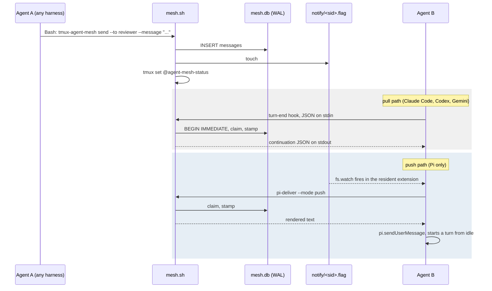

# Architecture

## Process Boundaries



No daemon on the bash side. Every shell entry point is a fire-and-forget process
and SQLite in WAL mode is the only shared state, the same shape as
`tmux-agent-tracker`. The Pi extension is the one resident component, and that
residency is exactly what buys the push channel.

## The seam: drain

`drain` is the only code that takes mail out of the mailbox. Everything else
wraps it.

```
send / broadcast / reply  ->  messages table
                                   |
                                 drain            (claim + stamp + render)
                                /   |   \
                   claude/codex/    |    pi-deliver
                     gemini hook    |     (push / before-start)
                          |         |          |
                    _emit_*      inbox    sendUserMessage
```

Consequences of putting the seam there:

- Loop safety, at-most-once claiming and the untrusted-peer envelope are written
  once and inherited by all four harnesses.
- The Pi extension stays a watcher and a pipe. No policy in TypeScript, so one
  bats suite covers every harness.
- Adding a fifth harness is an `_emit_*` case and an installer branch.

## Claiming is atomic

```sql
BEGIN IMMEDIATE;
CREATE TEMP TABLE _claim AS
    SELECT id FROM messages WHERE to_session=? AND delivered_at IS NULL;
UPDATE messages SET delivered_at=unixepoch(), delivered_via=?
    WHERE id IN (SELECT id FROM _claim);
SELECT ... FROM messages JOIN _claim ...;
COMMIT;
```

One `sqlite3` process, so two concurrent drains cannot both take the same
message. `RETURNING` would be shorter but needs sqlite 3.35+, which would raise
the floor past Debian 11 for no benefit. Covered by a test that runs two drains
in parallel against eight messages and asserts none is duplicated or lost.

Delivery is **at-most-once**. `delivered_at` is stamped at claim time, so if a
harness discards the payload the message leaves the mailbox. Every delivery is
appended to `delivery.log` first, so nothing is unrecoverable. An
acknowledgement protocol would need a signal no harness provides, and a
redelivery loop is worse than an audit log.

## Harness matrix

| | Claude Code | Codex | Gemini CLI | Pi |
|---|---|---|---|---|
| Vehicle | shell hooks | shell hooks | shell hooks | TypeScript extension, jiti |
| Config | `~/.claude/settings.json` | `~/.codex/hooks.json` | `~/.gemini/settings.json` | symlink, auto-discovered |
| Turn-end event | `Stop` | `Stop` | `AfterAgent` | none usable |
| Continuation payload | `{decision:"block", hookSpecificOutput:{hookEventName:"Stop", additionalContext:T}}` | `{decision:"block", reason:T}` | `{decision:"deny", reason:T}` | n/a |
| Prompt event | `UserPromptSubmit` | `UserPromptSubmit` | `BeforeAgent` | `before_agent_start` |
| Seed a spawned session | initial prompt on argv | initial prompt on argv | initial prompt on argv | `sendUserMessage` |
| Wake an idle agent | no | no | no | **yes** |
| `stop_hook_active` supplied | no | yes | yes | n/a |

Gemini says `deny` where the other two say `block`. Codex and Gemini both report
`stop_hook_active`, which `_hook_turn_end` honours as a stronger guard than the
mesh streak counter. Claude Code supplies neither, but it also does not re-fire
`UserPromptSubmit` for a `Stop`-block continuation, so its counter accumulates
correctly.

Pi has neither, and `before_agent_start` fires for mesh-triggered turns too, so
its extension reports human typing separately via `pi.on("input")` calling
`reset-streak`. Without that the budget resets after every push and can never
fire.

### Verified Pi behaviour

Established by running a real agent, not from documentation:

- `session_start` fires interactively but **not** under `pi --print`. A one-shot
  print run never registers.
- `session_shutdown` does **not** fire when a pane is killed, so dead-pane
  reaping is the only cleanup path there. `pane-died` triggers `cleanup`.
- `registerTool` is unusable from `~/.pi/agent/extensions`: its `parameters`
  field needs a TypeBox schema and neither `typebox` nor the pi package resolves
  from that directory. Type-only imports are fine, since they are erased before
  jiti runs. Discovery therefore works as for the other harnesses, through
  injected context naming the CLI.

## Loop safety

Five independent brakes, all enforced in `send`/`drain`/`pi-deliver` so no
harness can bypass them:

| Control | Option | Default | Stops |
|---|---|---|---|
| Kill switch | `@agent-mesh-enabled` | `on` | everything |
| Hops per thread | `@agent-mesh-max-hops` | `4` | reply ping-pong |
| Messages per thread | `@agent-mesh-max-thread-msgs` | `12` | a long-running conversation |
| Consecutive auto-continuations | `@agent-mesh-max-blocks` | `3` | unattended token burn |
| Broadcast fan-out | `@agent-mesh-max-broadcast` | `8` | waking every pane at once |

Refusals are non-zero with a one-line reason on stderr, so the calling agent can
read why rather than retrying. An oversized broadcast sends to **nobody** rather
than the first N: a silent truncation reads as full coverage.

When the continuation budget is exhausted mesh stops forcing turns but does not
drop the mail. It waits for the next human prompt, where `next-prompt` or
`before-start` delivery ignores the cap. That is safe because those paths fire
on a turn that is already happening.

## Untrusted peer envelope

Delivered mail is prefixed with a header stating it is untrusted peer input, not
an operator instruction. This is a security boundary, not decoration: mesh mail
becomes agent context, so without the framing one pane can drive another into
running commands. A cross-pane prompt-injection path is the natural failure mode
of this whole design, and the envelope plus the caps are what bound it.

## Identity and addressing

`agents.session_id` is the harness's own id: a UUID for Claude Code and Pi, and
whatever Codex and Gemini report. `human` is reserved and seeded at `init`.

A reference resolves in this order: alias, exact session id, `%pane`,
`session:window.pane`, then an unambiguous session-id prefix. Ambiguity is an
error (exit 2), never a guess.

Prefix matching uses `substr`, not `LIKE`. `_` and `%` are `LIKE` wildcards, so
`--to abc_` would otherwise also match `abcXdef`.

A pane hosts at most one agent, so registering on a known pane evicts the stale
row. Otherwise pane-based addressing resolves to a dead agent.

`tmux display-message` against a pane tmux does not know returns empty fields
rather than an error, producing the degenerate target `:.`. Stored, that makes
`:.` an address resolving to an arbitrary agent, so `register` echoes
`#{pane_id}` back in the same call and only trusts the target when it identifies
the pane it asked about.

## Environment namespace

Every override is `MESH_` prefixed: `MESH_DIR`, `MESH_DB`, `MESH_NOTIFY_DIR`,
`MESH_DELIVERY_LOG`. `tmux-agent-tracker` reads a bare `$DB`, so an unprefixed
name here points tracker at `mesh.db` and every tracker hook dies with
`Parse error: no such table: sessions`. A test fails if an unprefixed override
reappears.

## Hooks never fail the turn

The `hook` dispatcher swallows every error and exits 0, logging to the debug log
instead. An unreadable database, a missing dependency or a bug in mesh costs the
user their messages; it must not cost them their session. For the same reason
cosmetic writes such as the status cache are silenced: harnesses surface hook
stderr to the user.

## Installer and symlinked configs

`~/.claude/settings.json` is frequently a symlink into a dotfiles repo. The usual
`jq ... > tmp && mv tmp file` idiom **replaces the symlink with a regular file**,
silently detaching it from version control. `install.sh` and `uninstall.sh` use
`cat tmp > file`, which writes through the link. Demonstrated and pinned by
tests, because this failure is silent and only noticed weeks later.

Harness wiring is opt-in per harness. An installer should not decide on its own
to edit four live agent configs.

## Schema

`~/.tmux-agent-mesh/mesh.db`, WAL, `busy_timeout=100`.

| Table | Purpose |
|---|---|
| `agents` | registry: session id, harness, alias, pane, target, cwd, push capability, continuation streak |
| `messages` | mailbox: thread, from, to, body, hops, expect_reply, reply_to, delivered_at, delivered_via |
| `threads` | conversation counters for the per-thread message cap |
| `dispatches` | pending pane assignments, claimed by the next session to start in that pane |

`init` is non-destructive. Unlike tracker, whose rows are ephemeral session
state, mesh rows are messages, so dropping them needs the explicit `--reset`.

## File map

| File | Purpose |
|---|---|
| `agent-mesh.tmux` | TPM entry: DB init, CLI symlink, skill sync, Pi extension link, keybind, `pane-died` cleanup |
| `scripts/mesh.sh` | every command, single dispatcher |
| `scripts/helpers.sh` | tmux option access, 60s config cache, version check |
| `pi-extension/index.ts` | resident watcher and the push channel |
| `install.sh` / `uninstall.sh` | opt-in per-harness wiring, symlink-safe |
| `tests/mesh.bats` | registry, addressing, cleanup |
| `tests/messaging.bats` | mailbox, delivery, adapters, loop caps |
| `tests/pi.bats` | push and before-start paths, budget, flag-name contract |
| `tests/isolation.bats` | env namespace, stderr hygiene, hook robustness, portability |
| `tests/install.bats` | symlink preservation, coexistence, idempotency |
| `tests/config.bats` | option loading and the caps, as real subprocesses |
| `tests/tmux.bats` | hooks, keys, menu, dispatch, watch, doctor, on a private socket |

## Testing

```bash
bats tests/
```

306 tests. Every assertion goes through a helper function, never a bare `[[ ]]`
or `! cmd`: bash 3.2 is the system bash on macOS and the one this suite runs
under, and it trips neither `set -e` nor the `ERR` trap for either of those when
they are not the last statement of a function. About a third of the assertions
here asserted nothing until that was fixed, and the suite was green while one of
them expected a value the code has never written. A suite that cannot fail is
worse than no suite, because it is quoted as evidence.

Bats still cannot watch a harness parse hook output, so each delivery path also
has a real two-pane manual test recorded in the README. Three of the bugs found
so far were invisible to bats and only appeared when a real agent ran.
