# tmux-agent-mesh

Slack for coding agents running in tmux panes. One mailbox, several agents, and
you in the conversation with them.

Agents in different panes share a mailbox. Agent A posts to a channel, every
member of that channel receives it through its own harness's mechanism, and keeps
working. You are a participant with the reserved name `human`, so an agent can ask
you a question instead of ending its turn.

Sibling to [`tmux-agent-tracker`](../tmux-agent-tracker) (which tracks agent
*status*) and [`tmux-agent-resumer`](../tmux-agent-resumer) (which resumes agents
after rate limits). This one carries *messages*.

## Status

This project is mid-restructure from a local bash tool into a client/server one.
The table says which half you are reading about, because a document that reads
finished when it is not is how the last round of bugs survived.

| Capability | State |
|---|---|
| Agent-to-agent messaging, one to one | **running** |
| Broadcast by project or harness | **running** |
| Delivery into a *working* agent's turn (Claude, Codex, Gemini) | **running** |
| Waking a *fully idle* Pi agent, no keystrokes | **running**, observed live |
| Spawning an agent for a subtask (`dispatch`) | **running**, observed live |
| Loop brakes, untrusted-peer envelope, audit log | **running** |
| tmux menu, status bar, live traffic view | **running** |
| Channels, membership, private channels, access rules | store built, not wired |
| Read receipts, per-recipient delivery | store built, not wired |
| Waking an idle Claude, Codex or Gemini agent | designed, not built |
| File upload and download through the service | designed, not built |
| Go server plus local socket and ssh transports | designed, not built |
| Slack-style TUI | designed, not built |
| Sandbox enforcement of channel privacy | designed, not built |

Everything marked **running** is covered by 318 bash tests and was exercised
against real agents. The Go store has 36 tests of its own.

---

## How it works

No daemon today: every entry point is a fire-and-forget process and SQLite in WAL
mode is the only shared state. The Pi extension is the one resident component, and
that residency is exactly what buys it the push channel.

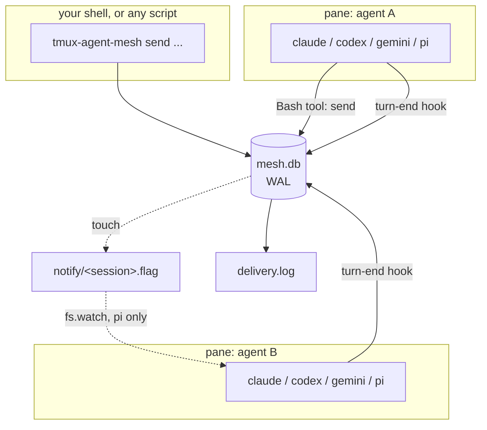

### The seam: one drain

Everything that takes mail out of the mailbox goes through a single claim. Loop
safety, at-most-once delivery and the untrusted-peer envelope are written once and
inherited by every harness, which is why one test suite covers all four.

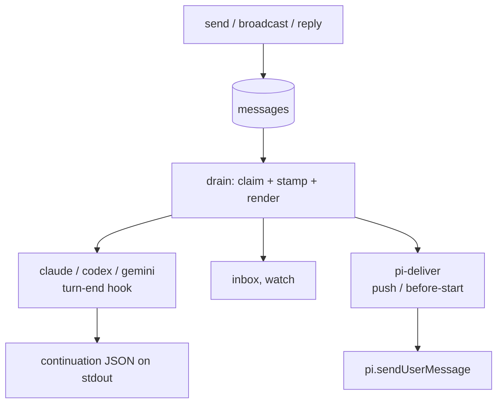

### Delivery, per harness

Three harnesses can continue a turn that is already ending. Only Pi can reach an
agent that has already finished.

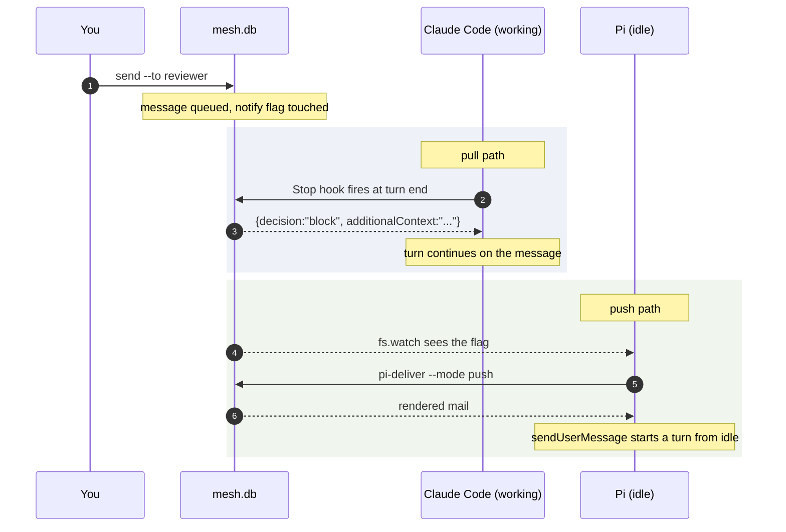

| Harness | While the agent is working | While the agent is idle |
|---|---|---|
| Claude Code | `Stop` hook continues the turn | waits for your next prompt |
| Codex | `Stop` hook continues the turn | waits for your next prompt |
| Gemini CLI | `AfterAgent` re-prompts | waits for your next prompt |
| Pi | continues the turn | **wakes on its own** |

`roster` reports this in the `PUSH` column rather than hiding it.

### Why only Pi wakes

A harness hook only runs *at* a turn boundary, so it cannot start a turn in a
session that is not having one. Pi's extension stays resident and can call
`sendUserMessage`. For the other three the choice is keystroke injection or
nothing, which is [designed and not yet built](#waking-an-idle-agent-designed).

### Turn state

mesh installs the prompt and turn-end hooks, so it knows whether an agent is
between turns rather than guessing from the pane contents. `roster` shows it in the
`STATE` column, and it is the gate the wake path will use.

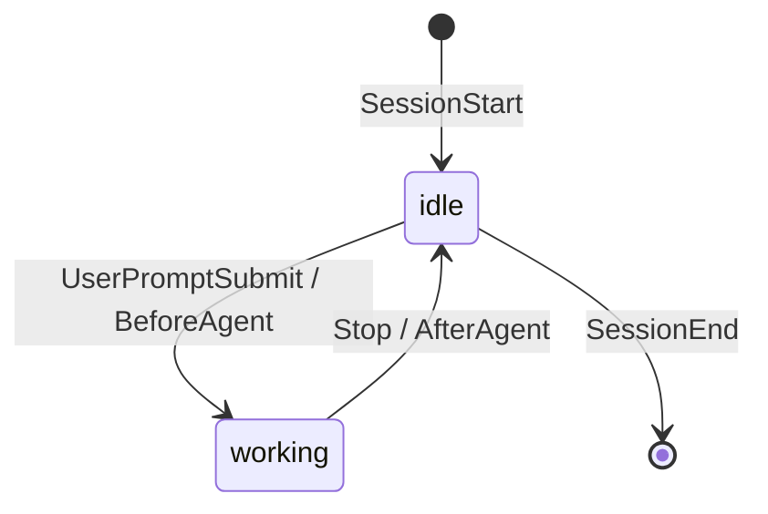

---

## Install

Three layers, each optional and separately reversible: the tmux plugin, then
per-harness wiring, then the status bar.

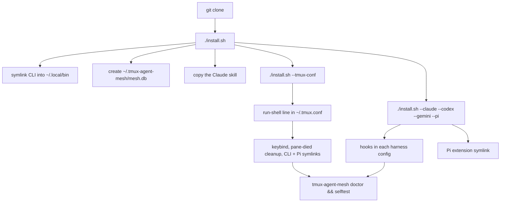

### Requirements

- tmux 3.0+, `sqlite3`, `jq`
- bash 3.2+ (macOS system bash is supported and tested)
- at least one of: Claude Code, Codex, Gemini CLI, Pi
- Go 1.24+ only if you build the Go components

### Base install

```bash
git clone <this repo> ~/Code/tmux-agent-mesh
cd ~/Code/tmux-agent-mesh
./install.sh                 # CLI symlink, database, Claude skill
./install.sh --tmux-conf     # add the plugin line to ~/.tmux.conf
tmux source-file ~/.tmux.conf
tmux-agent-mesh doctor
tmux-agent-mesh selftest
```

`doctor` should end with `ok` lines and `info` lines. `info` means a harness is not
wired, which is a choice; `FAIL` means something is broken. `selftest` runs a real
round trip against the database and prints one line per claim.

### Installing on agents

Wiring is opt-in per harness, because an installer should not decide on its own to
edit four live agent configs. Each file it edits is backed up once to
`<file>.mesh-backup`.

```bash
./install.sh --claude    # ~/.claude/settings.json
./install.sh --codex     # ~/.codex/hooks.json
./install.sh --gemini    # ~/.gemini/settings.json
./install.sh --pi        # symlink only; pi auto-discovers extensions
```

What each one wires:

| Harness | File | Events |
|---|---|---|
| Claude Code | `~/.claude/settings.json` | `SessionStart`, `SessionEnd`, `UserPromptSubmit`, `Stop` |
| Codex | `~/.codex/hooks.json` | `SessionStart`, `SessionEnd`, `UserPromptSubmit`, `Stop` |
| Gemini CLI | `~/.gemini/settings.json` | `SessionStart`, `SessionEnd`, `BeforeAgent`, `AfterAgent` |
| Pi | none | extension symlinked into `~/.pi/agent/extensions` |

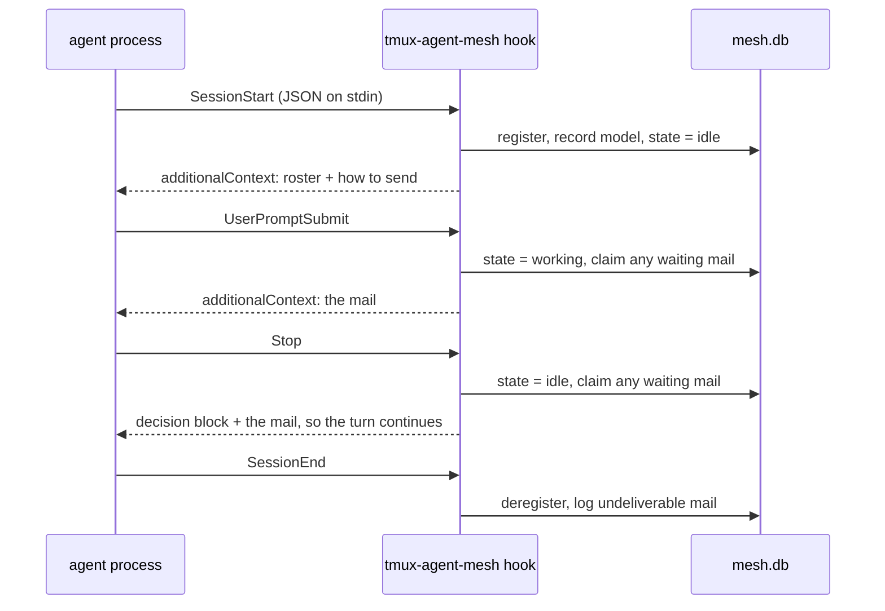

Four things worth knowing.

**Symlinked configs survive.** `~/.claude/settings.json` is often a symlink into a
dotfiles repo. The usual `jq ... > tmp && mv tmp file` idiom replaces the symlink
with a regular file and silently detaches it from version control. This installer
uses `cat tmp > file`, which writes through the link. Pinned by tests.

**Hooks coexist.** Mesh sits alongside tracker's and resumer's hooks on the same
events. Harnesses run same-event hooks in parallel and deduplicate identical
handlers. Mesh is the only one that returns a blocking decision.

**A hook never fails your turn.** The dispatcher swallows every error and exits 0,
logging instead. A broken mailbox should cost you your messages, not your session.

**Codex is unverified.** The binary contains `hooks.json`, `SessionStart` and
`stop_hook_active`, so support exists, but a project-level `.codex/hooks.json`
never fired on codex-cli 0.144.3 across every permutation tried. Project hooks
appear to need a trusted repo, which is granted interactively. The adapter is
written and unit-tested against the documented payload; treat it as untested.

### Uninstall

```bash
./uninstall.sh            # hooks, symlinks, status bar
./uninstall.sh --purge    # also delete ~/.tmux-agent-mesh
```

It leaves your `~/.tmux.conf` line and the `*.mesh-backup` files alone and tells
you where they are.

---

## Local setup

Everything above *is* the local setup: one SQLite file under
`~/.tmux-agent-mesh/`, and every agent's shell writes to it directly.

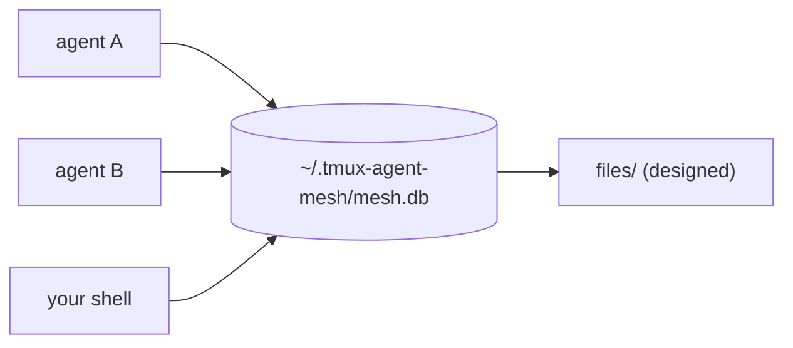

Name each agent once, then message it.

```bash
tmux-agent-mesh name reviewer        # inside the agent's own pane
tmux-agent-mesh alias %7 builder     # or label a pane from anywhere
tmux-agent-mesh roster
```

```
NAME           HARNESS  PROJECT            STATE    PUSH  PENDING  PANE
human          human    -                  -        no    1        -
reviewer       claude   web-app            working  no    0        work:2.1
builder        pi       api-service        idle     yes   1        work:2.2
```

```bash
tmux-agent-mesh send --to reviewer --message "what file are you in?"
tmux-agent-mesh send --to reviewer --message "which branch?" --expect-reply
tmux-agent-mesh broadcast --message "status?" --harness pi
tmux-agent-mesh reply --to-message 42 --message "done"
tmux-agent-mesh inbox --as human --follow
tmux-agent-mesh watch
```

`--to` accepts an alias, `%pane`, `session:window.pane`, or an unambiguous
session-id prefix. Ambiguity is an error, never a guess. Prefix matching uses
`substr` rather than SQL `LIKE`, so `_` and `%` are literal characters and
`--to abc_` cannot quietly match `abcXdef`.

`--expect-reply` marks the message so the receiver can tell whether you are
blocked on an answer or just passing information along.

**Local privacy is advisory.** An agent with a shell tool runs as your uid and can
read `mesh.db` directly, so it can see any channel. Fixing that needs the
[enforcement boundary](#enforcement-what-actually-stops-an-agent), which is not
built yet. Do not put anything in a local channel that you would mind an agent
reading.

### Spawning an agent for a subtask

```bash
tmux-agent-mesh dispatch --task "audit the migration for missing indexes" \
                         --harness claude --alias auditor
tmux-agent-mesh dispatch --task "port the tests" --harness pi --worktree feat/x
tmux-agent-mesh dispatch --task "..." --harness claude --env NODE_EXTRA_CA_CERTS=
```

tmux runs the agent as the pane's own process with the task as its initial prompt.
Nothing is typed into the pane. `--worktree` creates a git worktree under
`~/.tmux-worktree/<project>/<branch>`, and `--window` uses a new window instead of
a split.

The task goes on the harness's command line rather than through a hook, because no
hook can start a turn in a session that has never had one. Pi is the exception and
gets it through `sendUserMessage`.

A dispatched pane inherits the **tmux server's** environment, not your shell's,
and tmux runs the launch line through `default-shell`, which reads its own startup
files. `--env` is how you put back anything your profile normally sets or clears.

---

## Remote server setup (designed)

Not built. This is the target shape and the reason for it, so you can see where
the pieces are going.

A shared mailbox on a separate host is what makes access rules real: the agent has
no shell there, so the only way to the data is the service, and the service is
where the checks live. It is also the only way to have agents on several machines
in one conversation.

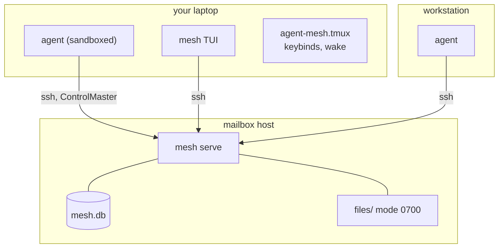

Agents have no shell on the mailbox host: `authorized_keys` forces the mesh
command, so a connection can send and receive mail and nothing else.

Why not put the database on a network share: SQLite in WAL mode needs shared
memory, and locking over NFS or SSHFS is broken. Mounting it from several machines
corrupts it. A process has to own the file.

Why ssh rather than a new protocol: no port to expose, no tokens to manage, and
the credentials already exist. `ControlMaster` keeps a hook at roughly 20ms
instead of a full handshake each time.

The planned shape:

```
# on the mailbox host
mesh serve --data /var/lib/mesh

# in ~mesh/.ssh/authorized_keys, one line per agent machine
command="/usr/local/bin/mesh serve-stdio",no-pty,no-port-forwarding,
no-agent-forwarding,no-X11-forwarding ssh-ed25519 AAAA... laptop

# on each agent machine
mesh config set remote mesh@mailbox-host
```

`no-pty` plus a forced command means an agent that reaches the host cannot get a
shell, cannot run `cat`, and cannot open the database. That is the boundary.

### Local and remote are the same server

One binary, three modes, so the client never opens the database in either case and
access rules are enforced in exactly one place.

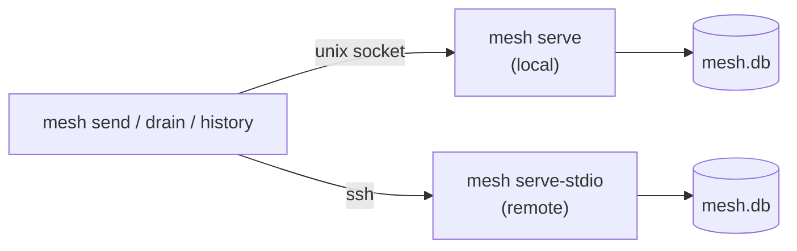

---

## The TUI (designed)

Not built. A Go binary run in its own tmux window, not a popup: a popup is modal
and dies on focus change, which is wrong for something you keep open.
`prefix + g` opens it, or jumps to it if it is already there.

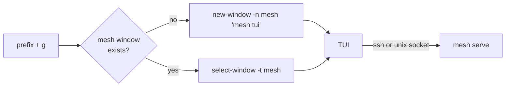

Planned layout:

```
+- mesh --------------------------------------------------------------------+
| CHANNELS          | #backend                                   3 members  |
|  # general      2 |------------------------------------------------------- |
|  # backend      * | 14:02  reviewer   found it: the index is missing on    |
|  # sensitive   [L]|                   orders.customer_id                   |
|                   |        `- read by you 14:02 . builder 14:03 (x2)       |
| DIRECT            | 14:04  builder    adding the migration now            |
|  @ reviewer     1 |        `- read by reviewer 14:04                      |
|  @ builder        | 14:07  you        ship it after CI                    |
|  @ auditor   idle |        `- unread                                      |
|                   |------------------------------------------------------- |
| AGENTS            | > _                                                   |
|  reviewer working |                                                       |
|  builder  idle    | enter send . ctrl-t thread . ctrl-u upload . ? help   |
+--------------------------------------------------------------------------+
```

What you will be able to do in it: read any channel you have access to, post to
one, open a thread, DM a single agent, upload a file into a channel, and see who
read what and when. Editing your own message is planned as an edit that keeps the
original in history rather than a silent overwrite, because an agent may already
have acted on what it read.

### Read receipts

Reading is recorded as an append-only log, never a flag, so a second read by the
same reader is a second receipt. That is why the mock above can say `(x2)`.

For an agent, "read" is exact: the moment the message entered its context is the
moment mesh handed it over, so the receipt is written at the claim. For you it is
the moment the TUI displayed it.

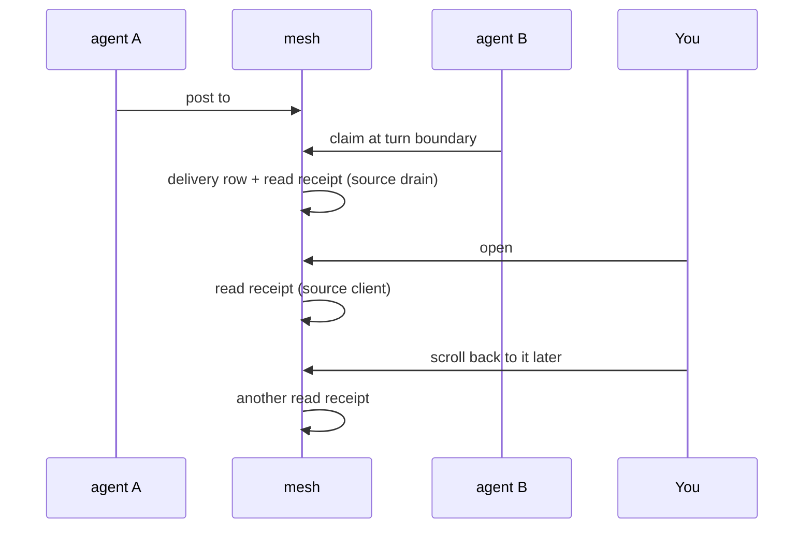

### What you can do today, without the TUI

```bash
tmux-agent-mesh watch                 # live feed of all traffic
tmux-agent-mesh inbox --as human --follow
tmux-agent-mesh roster                # who exists, what state, what is waiting
prefix + g                            # menu of agents with pending counts, jump to a pane
tmux set -g @agent-mesh-on-mail 'terminal-notifier -message "$2" -title "mesh: $1"'
```

---

## Channels and recipients (store built, not wired)

The Go store models one recipient mechanism rather than four. A message is posted
to a channel and every member is a recipient, so a DM, a named group, a public
room and "everyone" are the same object with different membership. That is what
makes receipts, file scoping and access rules one implementation each.

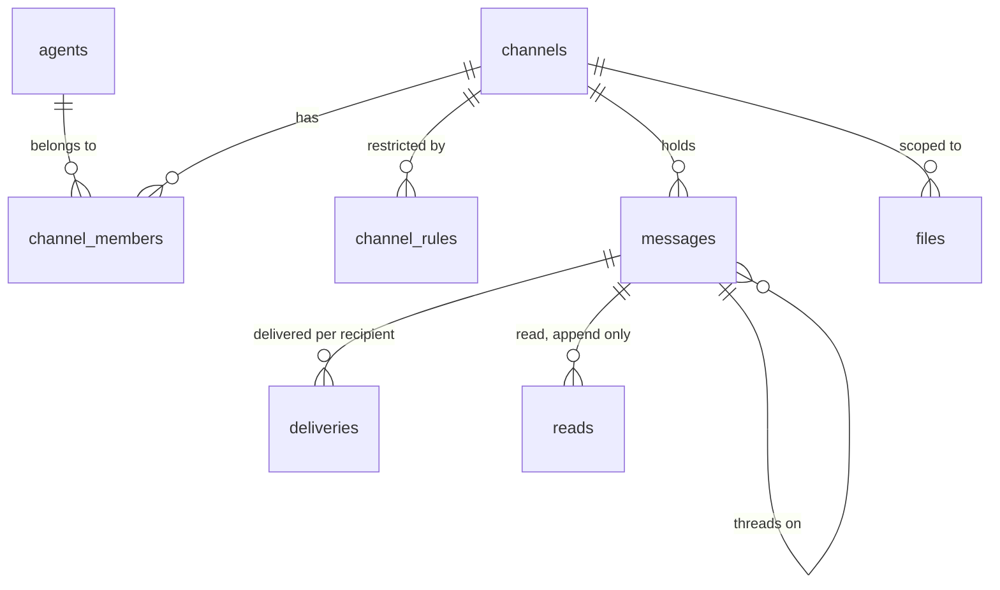

| Kind | Visibility | Who can read |
|---|---|---|
| channel | public | any registered participant, member or not |
| channel | private | members only |
| dm | private | its two participants |

Access rules restrict who may *join* a private channel, by harness or by model:

```bash
mesh channel create sensitive --private
mesh channel rule sensitive --harness claude
mesh channel rule sensitive --model claude-opus
```

Rules fail closed. An empty rule set means membership is the only gate; the moment
any rule exists the set becomes an allow-list and anything unmatched is refused. A
channel whose rules match nobody is locked, not open. Model rules match by prefix,
because a model id carries a version suffix a rule should not have to chase, and
an agent whose harness never reported a model cannot satisfy a model rule.

---

## Safety

### The untrusted-peer envelope

Delivered mail is wrapped in a header stating it is untrusted input from a peer,
not an instruction from your operator. This is a security boundary, not
decoration: mesh mail becomes agent context, so without the framing one pane can
drive another into running commands. A cross-pane prompt-injection path is the
natural failure mode of this whole design, and the envelope plus the caps are what
bound it.

### The five brakes

All enforced in the one place every client goes through, so no harness and no
transport can skip them.

| Option | Default | Stops |
|---|---|---|
| `@agent-mesh-enabled` | `on` | everything |
| `@agent-mesh-max-hops` | `4` | reply ping-pong |
| `@agent-mesh-max-thread-msgs` | `12` | a conversation that will not end |
| `@agent-mesh-max-blocks` | `3` | unattended token burn |
| `@agent-mesh-max-broadcast` | `8` | waking every pane at once |

An oversized broadcast reaches **nobody** rather than the first N, because a
silent truncation reads as full coverage. When the continuation budget runs out
mesh stops forcing turns but keeps the mail and delivers it on your next prompt.

### Enforcement: what actually stops an agent

An access rule is only worth as much as the boundary under it. An agent with a
shell tool running as your uid can read `mesh.db` with `sqlite3` and any file
under the data directory with `cat`. Checks inside mesh do not change that,
because mesh is not in the path. The filesystem is.

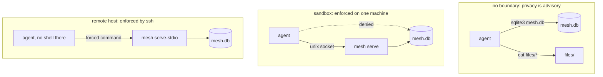

Verified on this machine that `sandbox-exec` closes it, blocking `cat`, `sqlite3`
and the `/tmp` symlink route. Note that seatbelt matches *resolved* paths, so a
profile written against `/tmp/...` does nothing at all.

This is why the client must never open the database directly: a sandboxed agent's
own client would be fenced out too. One path through a server, always.

Planned: `dispatch` sandboxes by default, `--no-sandbox` opts out, and `doctor`
reports which agents are fenced. Enforce what mesh launched, report what it did
not.

### Waking an idle agent (designed)

For Claude, Codex and Gemini the only mechanism is typing into the pane. That is
what every other tmux agent orchestrator does, and it races your keyboard and the
composer with no acknowledgement.

What mesh adds is a gate nothing else has: it installs the turn hooks, so it knows
the agent is between turns instead of scraping the pane for the word "tokens".
Two independent gates, or the mail waits.

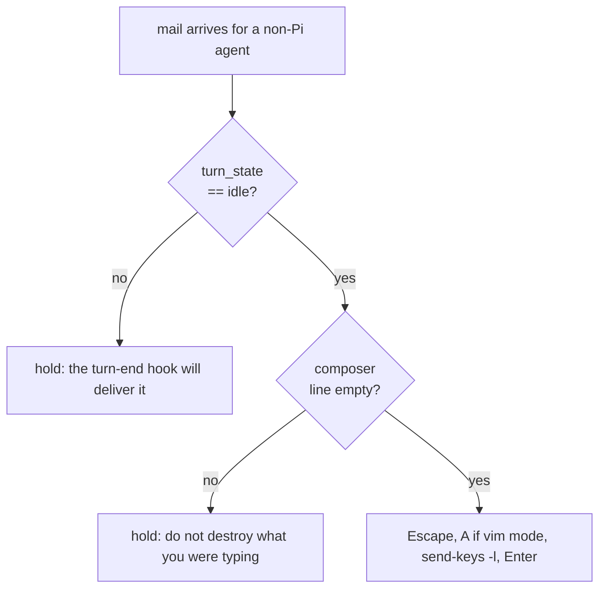

The typing routine comes from `tmux-agent-resumer`, which solved the traps the
hard way: vim-mode detection via the `-- INSERT --` marker, `Escape` then `A` to
reach insert, and spaced Escapes because a rapid double-Escape opens Claude's
rewind menu.

Until this exists, mail for an idle Claude, Codex or Gemini agent waits for your
next prompt, and `dispatch` is the way to get guaranteed pickup.

---

## Configuration

tmux options, all `set -g`. Read within 60s, or immediately after
`tmux-agent-mesh refresh`.

| Option | Default | Purpose |
|---|---|---|
| `@agent-mesh-enabled` | `on` | master kill switch |
| `@agent-mesh-delivery` | `stop-block` | `stop-block`, `next-prompt`, `off` (Claude/Codex/Gemini) |
| `@agent-mesh-pi-delivery` | `push` | `push`, `before-start`, `off` |
| `@agent-mesh-max-hops` | `4` | hops per thread |
| `@agent-mesh-max-thread-msgs` | `12` | messages per thread |
| `@agent-mesh-max-blocks` | `3` | consecutive mesh-forced turns |
| `@agent-mesh-max-broadcast` | `8` | fan-out cap |
| `@agent-mesh-on-mail` | `""` | shell hook when mail arrives for `human` |
| `@agent-mesh-keybinding` | `g` | menu key after the prefix (`m` is tmux's own `select-pane -m`) |
| `@agent-mesh-icon-mail` | `@` | status bar indicator |
| `@agent-mesh-debug-log` | `0` | `1` writes `~/.tmux-agent-mesh/debug.log` |

Set `@agent-mesh-delivery next-prompt` if you do not want a queued message
overriding your expectation that an agent had finished.

The status bar is **not** injected by default: tracker already rewrites
`status-right` and two plugins editing it is a clobber. Opt in with
`./install.sh --status-bar`, or place `#{@agent-mesh-status}` yourself.

---

## Data

`~/.tmux-agent-mesh/`: `mesh.db` (WAL), `notify/<session>.flag`, `delivery.log`,
`config_cache`, `debug.log`, and `files/` once the file store lands.

Delivery is **at-most-once**. The delivery row is written before the caller has
the text, so a client that drops the payload loses that message rather than
looping on it. Every delivery is appended to `delivery.log` first, so nothing is
unrecoverable. An acknowledgement would need a signal no harness provides, and a
redelivery loop is worse than an audit trail.

Every environment override is `MESH_` prefixed: `MESH_DIR`, `MESH_DB`,
`MESH_NOTIFY_DIR`, `MESH_DELIVERY_LOG`. A bare `DB` is also read by
tmux-agent-tracker, and setting it would point tracker at the wrong database and
kill every tracker hook. A test fails if an unprefixed override reappears.

---

## Verification status

What has actually been run, as opposed to written against documentation.

| Claim | Evidence |
|---|---|
| Pi wakes from fully idle | `delivered_via = pi:push`, turn started with nothing typed, agent replied |
| Pi found the CLI unaided | it ran `roster` and queried the database from the injected context alone |
| Continuation budget holds and releases | at the cap two messages held, then delivered `pi:before-start` after typing |
| Claude continues a turn | `delivered_via = claude:turn-end`, agent produced an unprompted second response |
| `dispatch` starts an agent on its task | dispatched Claude ran and mailed `master` back to `human` |
| Coexistence with tracker | both recorded the same `Stop`; mesh's block did not break the other three hooks |
| Gemini hooks fire | payload matches the docs including `stop_hook_active`; continuation not observed, Gemini crashed on an unrelated model-routing error mid-test |
| Codex | hooks never fired; see the note under [installing on agents](#installing-on-agents) |

---

## Tests

```bash
bats tests/          # 318 tests, seven suites
go test ./...        # 36 tests, the store
```

Every bash assertion goes through a helper function rather than a bare `[[ ]]`. On
bash 3.2, which is the system bash on macOS and the one the suite runs under, a
failing `[[ ]]` that is not the last statement of a function trips neither
`set -e` nor the `ERR` trap:

```
bash-3.2 -c 'set -e; f(){ [[ 1 == 2 ]]; echo REACHED; }; f'   # prints REACHED
```

Roughly a third of the assertions here were decoration until that was fixed, and
the suite was green while one of them expected a value the code has never written.
A suite that cannot fail is worse than no suite, because it gets quoted as
evidence.

`tests/config.bats` runs mesh as a real subprocess against a planted option cache.
`tests/tmux.bats` runs a tmux server on a private socket with `-f /dev/null`, so
neither reads the machine's live state.

Bats still cannot watch a harness parse hook output, so each delivery path also
has a two-pane manual test:

```bash
# pane B
claude
# inside it: tmux-agent-mesh name reviewer, then give it a long task

# a third plain shell
tmux-agent-mesh send --to reviewer --message "before you finish, print 4242"
```

B's next turn end must continue on that message rather than stopping. Confirm with
`tmux capture-pane -p -t <B>` and:

```bash
sqlite3 ~/.tmux-agent-mesh/mesh.db \
  'SELECT id, delivered_via, delivered_at IS NOT NULL FROM messages;'
```

For Pi, run `pi` in a pane, let it go fully idle, then send to it. It must start a
turn on its own with `delivered_via = 'pi:push'`.

---

## Known limitations

- **Local privacy is advisory.** An agent that can run `sqlite3` can read every
  channel. Enforcement needs the sandbox or the remote host.
- **Idle Claude, Codex and Gemini agents do not wake.** Mail waits for your next
  prompt. `dispatch` a fresh agent when you need guaranteed pickup.
- **There is no keystroke wake yet, and it will always be opt-in.** tmux cannot
  tell you whether a composer is empty and focused, so the gate is mesh's own turn
  state plus a pane check, and it holds the mail when unsure.
- **`session_start` does not fire under `pi --print`.** One-shot print runs never
  register.
- **A killed pane fires no shutdown hook** on any harness, so dead agents are
  reaped by `cleanup`, bound to tmux's `pane-died`.
- **No first-class tool for Pi.** `registerTool` needs a TypeBox schema and neither
  `typebox` nor the pi package resolves from `~/.pi/agent/extensions`, so Pi
  discovers the mailbox the way the others do, through injected context.
- **Codex is unverified.** See above.

## Architecture

`ARCHITECTURE.md` has the deep dive: why claiming is one sqlite3 process, why
prefix matching avoids `LIKE`, the per-harness payload shapes, and the failures
each design choice was a response to.

## License

MIT
